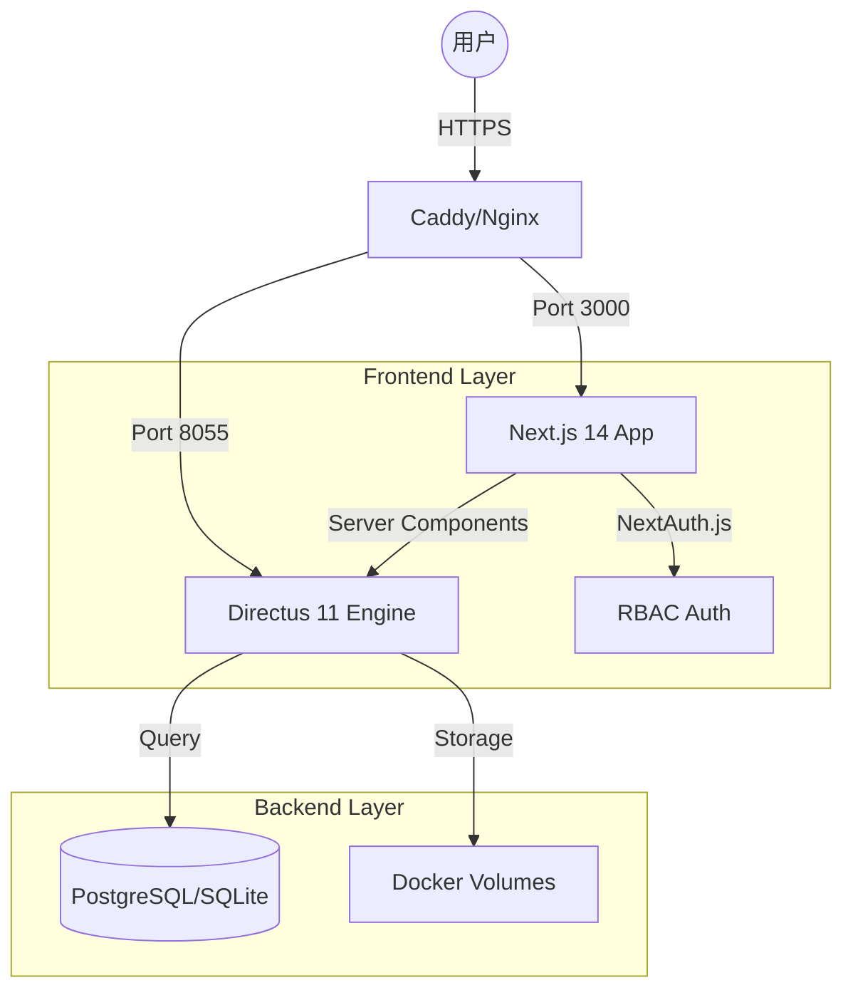

#  AI 智能体产业发展联盟 — 平台网站

[](https://opensource.org/licenses/MIT)
[](https://nextjs.org/)
[](https://directus.io/)

基于 Next.js 14 + Directus 11 构建的联盟官方门户网站与企业服务平台。

## 📖 目录
- [项目概述](#-项目概述)
- [系统架构](#-系统架构)
- [目录结构](#-目录结构)
- [技术栈](#-技术栈)
- [快速开始](#-快速开始)
- [开发指南](#-开发指南)
- [部署说明](#-部署说明)

---

## 🌟 项目概述

本平台为浙江省 AI 智能体产业发展联盟官方数字化载体，支撑以下核心业务场景：
- **公开门户**: 联盟介绍、新闻动态、服务大厅展示
- **企业服务**: 四步向导式企业能力档案填报、数据概览
- **秘书处运营**: 三层结构企业审批台、运营驾驶舱、供需撮合管理

---

## 🏗️ 系统架构



---

## 📁 目录结构

```text
zhejiang-ai-alliance/
├── backend/                # 后端基础设施与辅助脚本
│   ├── scripts/            # Directus 初始化与管理脚本 (迁移至此)
│   ├── database/           # 数据库持久化目录
│   └── uploads/            # 附件存储目录
├── frontend/               # 前端门户应用 (Next.js 14)
│   ├── app/                # 页面路由与业务逻辑
│   ├── components/         # 共享 UI 组件
│   ├── lib/                # 工具库与 SDK 封装
│   └── public/             # 静态资源
├── docs/                   # 项目全量文档
│   ├── architecture_design.md
│   ├── getting-started.md  # 详细启动步骤
│   └── deployment_guide.md
├── docker-compose.yml      # 全栈容器编排
└── README.md               # 项目主入口
```

---

## 🚀 快速开始

### 1. 环境准备
- Docker & Docker Compose
- Node.js 20+

### 2. 启动服务

#### 选项 A：本地开发模式 (推荐)
```bash
# 启动后端容器
docker-compose up -d

# 启动前端应用
cd frontend
npm install
npm run dev
```

#### 选项 B：全栈容器化 (生产/测试预览)
```bash
# 需确保 frontend 下已构建镜像或在 docker-compose 中定义了 build
docker-compose -f docker-compose.yml up -d
```

### 3. 初始化后端
```bash
# 进入后端脚本目录并运行初始化
cd backend/scripts
node setup-survey-schema.mjs
node enable-registration.mjs
```

详细启动说明请参考 [快速启动指南](docs/getting-started.md)。

---

## 🛠️ 技术栈

| 领域 | 技术 |
| :--- | :--- |
| **前端框架** | Next.js 14 (App Router) |
| **后端 CMS** | Directus 11 |
| **认证** | NextAuth.js v5 |
| **样式** | Tailwind CSS + Shadcn UI |
| **容器化** | Docker + Docker Compose |

---

## 📄 许可证
本项目采用 [MIT License](LICENSE) 许可。
