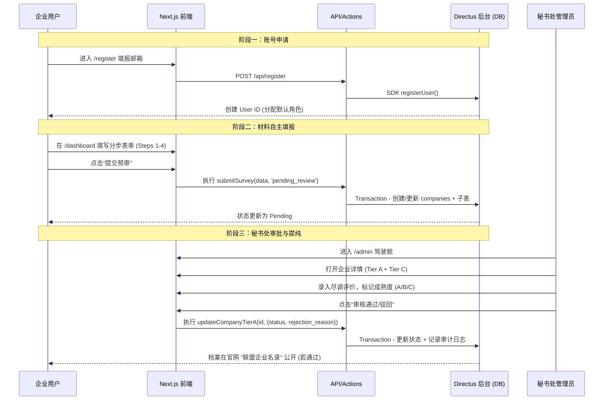

# 业务全链路逻辑与数据流深度分析报告

> 更新日期: 2026-03-13
> 目标：梳理从用户注册到后台审批的逻辑闭环，识别潜在风险并提出优化建议。

## 1. 全链路业务流程图 (End-to-End Workflow)

---

## 2. 核心逻辑审计与反馈

### 2.1 注册与账号体系 (Stage 1) - ✅ 已加固
- **实现逻辑**: 采用 Directus 自带的 `registerUser` 函数，通过 `/api/register` 路由解耦。
- **已加固**:
  - Rate Limiting: 每 IP 每小时最多 3 次注册请求
  - 角色分配: 明确指定默认角色 ID，防止配置漂移
- **待改进**:
  - 邮箱验证: 当前未启用（计划后续实现）

### 2.2 材料填报与数据采集 (Stage 2) - ✅ 已加固
- **实现逻辑**: `submitSurvey` 采用多层级字段平铺处理，使用 TransactionPromise 实现事务性提交。
- **已加固**:
  - **事务性**: 所有操作在同一事务中执行，失败自动回滚
  - **权限隔离**: 使用用户动态 Token，不使用静态 Token
  - **审计日志**: 提交操作自动记录到 audit_logs
- **优点**: RLS 数据隔离 + 服务端 Zod 校验

### 2.3 秘书处审批与数据提纯 (Stage 3) - ✅ 已加固
- **实现逻辑**: 区分了 **Tier A (公开申报)** 与 **Tier C (内部尽调)**。
- **已加固**:
  - **驳回反馈**: `rejection_reason` 字段已添加，企业可查看被拒原因
  - **审计日志**: 审批操作自动记录到 audit_logs
  - **导出脱敏**: 管理员导出数据时自动脱敏敏感字段

---

## 3. 数据结构分布总结 (Storage Mapping)

| 业务对象 | 存储位置 | 存储类型 | 数据敏感度 | 访问控制 |
|----------|----------|----------|------------|----------|
| 登录凭证 | `directus_users` | 系统表 | 高 | 仅本人/管理员 |
| 企业主体/联系人 | `companies` | 主表 | 中 | USER 仅自有，ADMIN 全部 |
| 业务能力/案例 | `products`, `case_studies` | 关联表 | 低 (拟公开) | public 只读 |
| 核心需求/痛点 | `survey_needs` | 关联表 | 中 | USER 仅自有，ADMIN 全部 |
| 安全/合规风控 | `compliance_risks` | 关联表 | 中 | ADMIN 仅见 |
| **秘书处评价/深度报告** | `org_internal_investigations` | **解耦表 (Tier C)** | **极高** | **ADMIN 仅见** |
| **审计日志** | `audit_logs` | **新增** | 高 | **ADMIN 仅见** |

---

## 4. 安全性改进总结

| 改进项 | 状态 | 说明 |
|--------|------|------|
| 静态 Token 改动态 Token | ✅ 已完成 | 用户操作使用会话 Token |
| 事务性提交 | ✅ 已完成 | submitSurvey 使用 TransactionPromise |
| 动态角色映射 | ✅ 已完成 | 登录时动态获取角色配置 |
| Rate Limiting | ✅ 已完成 | 登录/注册/认证接口限流 |
| 审计日志 | ✅ 已完成 | 记录关键操作到 audit_logs |
| 导出脱敏 | ✅ 已完成 | 自动脱敏电话、邮箱等字段 |
| 驳回原因反馈 | ✅ 已完成 | rejection_reason 字段 |
| Session 配置 | ✅ 已完成 | 24小时有效期 |
| 公开数据权限 | ✅ 已完成 | 字段级权限控制 |

---

## 5. 结论与后续建议

**逻辑评估：【健康 - 已加固】**

整个系统的逻辑闭环已打通并加固：
- ✅ 从**端上填报** -> **事务性提交** -> **数据权限隔离存储** -> **后台可视化审计** 的路径非常清晰
- ✅ 架构上采用了"申报层"与"运营层"的分离设计，满足了联盟对于数据"分层管理"的核心需求

**后续建议**:
1. **邮箱验证**: 实现用户注册邮箱验证
2. **多级审批**: 增加"初审→复审→终审"多层级流程
3. **消息通知**: 邮件/站内信通知审批状态变更
4. **数据备份**: 定期备份策略